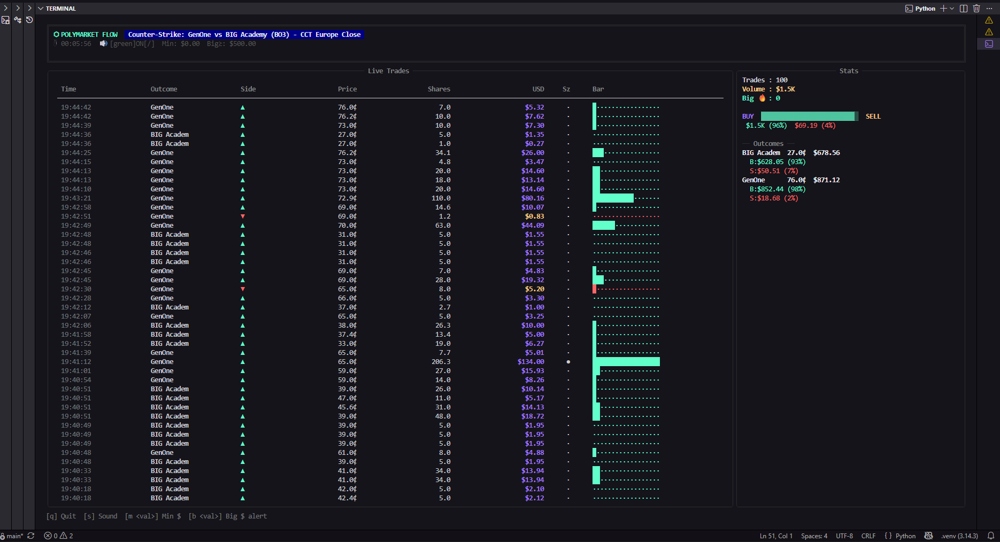

# ⬡ Polymarket Orderflow Terminal

Real-time order flow visualization for Polymarket directly in your terminal.

<p align="center">
  
</p>
## Features

* 📈 Live Polymarket trade feed
* 🔥 Large trade alerts
* 📊 Buy vs Sell volume statistics
* 🎯 Outcome-level tracking
* 🖥 Rich terminal interface (optional)
* 📉 Plain terminal fallback
* ⚡ WebSocket price updates
* 🔊 Sound notifications
* 🛠 Adjustable trade filters
* 🔍 Debug mode for API inspection
* 🔑 No API keys required

---

## APIs Used

This project uses only public Polymarket endpoints:

* Gamma API
* Data API
* CLOB API
* WebSocket market feed

No authentication is required.

---

## Installation

### Clone the repository

```bash
git clone https://github.com/YOUR_USERNAME/polymarket-orderflow-terminal.git

cd polymarket-orderflow-terminal
```

### Install dependencies

```bash
pip install rich websockets
```

---

## Requirements

* Python 3.9+
* Internet connection

Optional packages:

| Package    | Purpose              |
| ---------- | -------------------- |
| rich       | Enhanced terminal UI |
| websockets | Live price updates   |

---

## Running

Launch the program:

```bash
python polymarket_orderflow.py
```

or pass a market URL directly:

```bash
python polymarket_orderflow.py https://polymarket.com/event/example-market
```

---

## Controls

### Runtime commands

| Command     | Description               |
| ----------- | ------------------------- |
| `s`         | Toggle sound alerts       |
| `m <value>` | Minimum trade size filter |
| `b <value>` | Big trade alert threshold |
| `q`         | Quit                      |

Example:

```text
m 100
```

Shows only trades above $100.

---

## Debug Mode

Inspect raw API responses:

```bash
python polymarket_orderflow.py --debug
```

Useful when Polymarket changes API behavior.

---

## Example

Start:

```bash
python polymarket_orderflow.py
```

Paste a market URL:

```text
https://polymarket.com/event/...
```

The terminal will display:

* Live trades
* Buy/sell imbalance
* Trade sizes
* Outcome statistics
* Last prices
* Large trade alerts

---

## Example Output

```text
⬡ POLYMARKET ORDER FLOW

Trades: 1,204
Volume: $32.4K
Big Trades: 7

BUY ███████████████░░░░░
SELL ████████░░░░░░░░░░░

TIME      SIDE      PRICE      USD
12:34:11  ▲BUY      63.2¢    $1,250
12:34:15  ▼SELL     61.8¢      $420
12:34:18  ▲BUY      64.0¢    $3,100 🔥
```

---

## Disclaimer

This project is unofficial and is not affiliated with Polymarket.

Public APIs may change without notice, which can temporarily break functionality.

---
